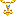
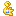
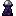
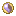
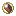
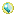
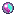
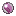
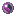
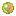

# Megas

Para megaevolucionar hacen falta tres cosas: una **Megapulsera** (o cualquier accesorio mega) puesta, el Pokémon
con **su megapiedra equipada** y estar en combate. Todo sale de dos estructuras enterradas en el Overworld.

## Piedra activadora y Megapulsera

1. Busca un **Megaroide**: un meteorito enterrado entre y −32 y y −20, en cualquier bioma del Overworld. Trae
   **una** Mena de Piedra Activadora.
2. Mínala con **pico de diamante** o mejor, **sin Toque de seda** (con Toque de seda sale la mena entera, que no
   sirve para nada). Suelta 1  **Piedra activadora**. Cada Megapulsera gasta una, así que cada jugador necesita su meteorito.
3. Fabrica la  **Megapulsera**:

| | | |
|---|---|---|
| Lingote de hierro | Diamante | Lingote de hierro |
| Bonguri blanco | Piedra activadora | Bonguri blanco |
| Lingote de hierro | Lingote de hierro | Lingote de hierro |

9 Piedras activadoras se pueden guardar como bloque (y volver a sacar). Las otras pulseras y accesorios hacen
lo mismo, solo cambia el look; todos llevan una Piedra activadora:

| Accesorio | Receta |
|---|---|
|  Megapulsera | Lingote de hierro · Diamante · Lingote de hierro Bonguri blanco · Piedra activadora · Bonguri blanco Lingote de hierro · Lingote de hierro · Lingote de hierro |
|  Megapulsera Roja | Lingote de hierro · Diamante · Lingote de hierro Bonguri rojo · Piedra activadora · Bonguri rojo Lingote de hierro · Lingote de hierro · Lingote de hierro |
|  Megapulsera Amarilla | Lingote de hierro · Diamante · Lingote de hierro Bonguri amarillo · Piedra activadora · Bonguri amarillo Lingote de hierro · Lingote de hierro · Lingote de hierro |
|  Megapulsera | Lingote de hierro · Diamante · Lingote de hierro Bonguri rosa · Piedra activadora · Bonguri rosa Lingote de hierro · Lingote de hierro · Lingote de hierro |
|  Megapulsera Verde | Lingote de hierro · Diamante · Lingote de hierro Bonguri verde · Piedra activadora · Bonguri verde Lingote de hierro · Lingote de hierro · Lingote de hierro |
|  Megapulsera Azul | Lingote de hierro · Diamante · Lingote de hierro Bonguri azul · Piedra activadora · Bonguri azul Lingote de hierro · Lingote de hierro · Lingote de hierro |
|  Megapulsera Negra | Lingote de hierro · Diamante · Lingote de hierro Bonguri negro · Piedra activadora · Bonguri negro Lingote de hierro · Lingote de hierro · Lingote de hierro |
|  Megacolgante de Aura | Bonguri amarillo · Caparazón de nautilo · Bonguri amarillo Lingote de hierro · Piedra activadora · Lingote de hierro Bonguri amarillo · Bonguri rosa · Bonguri amarillo |
|  Mega Anillo | Bonguri negro · Diamante · Bonguri negro Bonguri negro · Piedra activadora · Bonguri negro Lingote de hierro · Bonguri negro · Lingote de hierro |
|  Mega Anillo de Lysson | Lingote de hierro · Diamante · Lingote de hierro Lingote de hierro · Piedra activadora · Lingote de hierro Lingote de hierro · Lingote de hierro · Lingote de hierro |
|  Megapulsera de Bruno | — · Lingote de netherita · — Bonguri rojo · Piedra activadora · Bonguri rojo Bonguri rojo · Diamante · Bonguri rojo |
|  Guante de Corelia | — · Diamante · — Lingote de hierro · Piedra activadora · Lingote de hierro Bonguri rojo · Bonguri rojo · Bonguri rojo |
|  Mega Lentes de Magno | — · — · — Diamante · Piedra activadora · Diamante Lingote de hierro · Gafas especiales · Lingote de hierro |
|  Mega Ancla Aquiles | Lingote de oro · Cadena · Lingote de oro Lingote de oro · Piedra activadora · Lingote de oro Diamante · Lingote de oro · Diamante |
|  Diantha Mega Charm | — · Pepita de oro · Hilo Lingote de oro · Piedra activadora · Pepita de oro Lingote de oro · Lingote de oro · — |
|  Zinna Mega Anklet | Cadena · Guijarro celeste · Cadena Cadena · Piedra activadora · Cadena Cadena · Guijarro celeste · Cadena |
|  Mega Tiara de Ariana | Lapislázuli · — · Lapislázuli Lingote de hierro · Piedra activadora · Lingote de hierro Lapislázuli · — · Lapislázuli |

## Cómo megaevolucionar

- Pon la Megapulsera en el **espacio de accesorio mega** (botón de accesorios en el inventario). En la mano no sirve.
- Dale al Pokémon **su** megapiedra como objeto equipado. Cada piedra sirve para un solo Pokémon (ver tabla).
- En combate aparece el botón **Megaevolución**.
- **Solo una megaevolución a la vez** por equipo.
- Fuera de combate también se puede, con la tecla **Mega Evolve** (asígnala en Opciones → Controles → Mega
  Showdown). Pide tener buena amistad con el Pokémon.
- **Rayquaza** no usa megapiedra: megaevoluciona si sabe **Ascenso Draco**.

## De dónde salen las megapiedras

- **Mega Site** (única fuente en el mundo): estructura enterrada entre y −19 e y 5, en cualquier bioma del
  Overworld. Trae **un**  Cristal de Megapiedra. Con
  **pico de diamante** y **sin Toque de seda** suelta 1  **Megapiedra**, una megapiedra "en bruto".
- **Mesa de crafteo**: la Megapiedra + ingredientes = la megapiedra de cada Pokémon (tabla de abajo). Cada
  megapiedra cuesta una Megapiedra, o sea un Mega Site.
- **No salen de cofres ni de arqueología.** Los observatorios y sitios arqueológicos de Mega Showdown dan piedras
  evolutivas, gemas, Zygarde Cells y Bloques de Mega Meteorito, pero ninguna megapiedra. Las menas de Mega Meteorito
  dan piedras evolutivas (Fuego, Agua, Trueno...), no megapiedras.

## Megapiedras (86)

Las recetas son de mesa de crafteo, fila por fila (— = casilla vacía).

| Pokémon | Megapiedra | Receta |
|---|---|---|
| Abomasnow |  Abomasnowita | — · Antiderretir · — Lingote de hierro · Megapiedra · Lingote de hierro — · Diamante · — |
| Absol |  Absolita | — · Gafas de sol · — Lingote de hierro · Megapiedra · Lingote de hierro — · Diamante · — |
| Absol |  Absolita Z | — · Gema fantasma · — Piedra noche · Megapiedra · Piedra noche — · Diamante · — |
| Aerodactyl |  Aerodactylita | — · Garra afilada · — Lingote de hierro · Megapiedra · Lingote de hierro — · Diamante · — |
| Aggron |  Aggronita | — · Bola férrea · — Lingote de hierro · Megapiedra · Lingote de hierro — · Diamante · — |
| Alakazam |  Alakazamita | — · Cuchara torcida · — Lingote de hierro · Megapiedra · Lingote de hierro — · Diamante · — |
| Altaria |  Altarianita | — · Piedra día · — Lingote de hierro · Megapiedra · Lingote de hierro — · Diamante · — |
| Ampharos |  Ampharosita | — · Gema eléctrico · — Lingote de hierro · Megapiedra · Lingote de hierro — · Diamante · — |
| Audino |  Audinita | — · Gema normal · — Lingote de hierro · Megapiedra · Lingote de hierro — · Diamante · — |
| Banette |  Banettita | — · Piedra noche · — Lingote de hierro · Megapiedra · Lingote de hierro — · Diamante · — |
| Barbaracle |  Barbaraclita | — · Gema lucha · — Pizarra profunda · Megapiedra · Pizarra profunda — · Diamante · — |
| Baxcalibur |  Baxcaliburita | — · Espada de diamante · — Diamante · Megapiedra · Diamante — · Diamante · — |
| Beedrill |  Beedrillita | — · Polvo plata · — Lingote de hierro · Megapiedra · Lingote de hierro — · Diamante · — |
| Blastoise |  Blastoisita | — · Agua mística · — Lingote de hierro · Megapiedra · Lingote de hierro — · Diamante · — |
| Blaziken |  Blazikenita | — · Cinta aguante · — Lingote de hierro · Megapiedra · Lingote de hierro — · Diamante · — |
| Camerupt |  Cameruptita | — · Llamasfera · — Lingote de hierro · Megapiedra · Lingote de hierro — · Diamante · — |
| Chandelure |  Chandelurita | — · Gema fantasma · — Farol · Megapiedra · Farol — · Diamante · — |
| Charizard |  Charizardita X | — · Colmillo dragón · — Lingote de hierro · Megapiedra · Lingote de hierro — · Diamante · — |
| Charizard |  Charizardita Y | — · Carbón · — Lingote de hierro · Megapiedra · Lingote de hierro — · Diamante · — |
| Chesnaught |  Chesnaughtita | — · Escudo · — Casco dentado · Megapiedra · Casco dentado — · Diamante · — |
| Chimecho |  Chimechite | — · Campana · — Lingote de oro · Megapiedra · Lingote de oro — · Diamante · — |
| Clefable |  Clefablita | — · Pluma feérica · — Lingote de hierro · Megapiedra · Lingote de hierro — · Diamante · — |
| Crabominable |  Crabominablita | — · Gema hielo · — Guante de boxeo · Megapiedra · Guante de boxeo — · Diamante · — |
| Delphox |  Delphoxita | — · Carbón · — Polvo brillo · Megapiedra · Polvo brillo — · Diamante · — |
| Diancie |  Diancita | — · Piedra dura · — Lingote de hierro · Megapiedra · Lingote de hierro — · Diamante · — |
| Dragalge |  Dragalgita | — · Gema veneno · — Algas · Megapiedra · Algas — · Diamante · — |
| Dragonite |  Dragonitita | — · Élitros · — Lingote de oro · Megapiedra · Lingote de oro — · Diamante · — |
| Drampa |  Drampanita | — · Gema dragón · — Carga de viento · Megapiedra · Carga de viento — · Diamante · — |
| Eelektross |  Eelektrossita | — · Gema eléctrico · — Lingote de oro · Megapiedra · Lingote de oro — · Diamante · — |
| Emboar |  Emboarita | — · Gema fuego · — Carga ígnea · Megapiedra · Carga ígnea — · Diamante · — |
| Excadrill |  Excadrillita | — · Gema acero · — Lingote de hierro · Megapiedra · Lingote de hierro — · Lingote de hierro · — |
| Falinks |  Falinksita | — · Casco de oro · — Lingote de oro · Megapiedra · Lingote de oro — · Diamante · — |
| Feraligatr |  Feraligatrita | — · Colmillo agudo · — Lapislázuli · Megapiedra · Lapislázuli — · Diamante · — |
| Floette (solo Floette Eterna) |  Floettita | — · Amapola · — Lingote de netherita · Megapiedra · Lingote de netherita — · Diamante · — |
| Froslass |  Froslassita | — · Gema hielo · — Hielo · Megapiedra · Hielo — · Diamante · — |
| Gallade |  Galladita | — · Banda aguante · — Lingote de hierro · Megapiedra · Lingote de hierro — · Diamante · — |
| Garchomp |  Garchompita | — · Cinta fuerte · — Lingote de hierro · Megapiedra · Lingote de hierro — · Diamante · — |
| Garchomp |  Garchompita Z | — · Gema dragón · — Garra rápida · Megapiedra · Garra rápida — · Diamante · — |
| Gardevoir |  Gardevoirita | — · Gafas elección · — Lingote de hierro · Megapiedra · Lingote de hierro — · Diamante · — |
| Gengar |  Gengarita | — · Hechizo · — Lingote de hierro · Megapiedra · Lingote de hierro — · Diamante · — |
| Glalie |  Glalitita | — · Piedra hielo · — Lingote de hierro · Megapiedra · Lingote de hierro — · Diamante · — |
| Glimmora |  Glimmoranita | — · Gema roca · — Flecha venenosa · Megapiedra · Flecha venenosa — · Diamante · — |
| Golisopod |  Golisopodita | — · Gema bicho · — Revestimiento metálico · Megapiedra · Revestimiento metálico — · Diamante · — |
| Golurk |  Golurkita | — · Gema fantasma · — Cobre oxidado · Megapiedra · Cobre oxidado — · Diamante · — |
| Greninja |  Greninjanita | — · Agua mística · — Cubo de agua · Megapiedra · Cubo de agua — · Diamante · — |
| Gyarados |  Gyaradosita | — · Cinta fuerte · — Lingote de hierro · Megapiedra · Lingote de hierro — · Gema siniestro · — |
| Hawlucha |  Hawluchanita | — · Protector · — Lingote de oro · Megapiedra · Lingote de oro — · Diamante · — |
| Heracross |  Heracrossita | — · Gema bicho · — Lingote de hierro · Megapiedra · Lingote de hierro — · Diamante · — |
| Houndoom |  Houndoominita | — · Roca calor · — Lingote de hierro · Megapiedra · Lingote de hierro — · Diamante · — |
| Kangaskhan |  Kangaskhanita | — · Pañuelo de seda · — Lingote de hierro · Megapiedra · Lingote de hierro — · Diamante · — |
| Latias |  Latiasita | — · Cascabel alivio · — Lingote de hierro · Megapiedra · Lingote de hierro — · Gema psíquico · — |
| Latios |  Latiosita | — · Cascabel alivio · — Lingote de hierro · Megapiedra · Lingote de hierro — · Gema dragón · — |
| Lopunny |  Lopunnita | — · Vidasfera · — Lingote de hierro · Megapiedra · Lingote de hierro — · Diamante · — |
| Lucario |  Lucarionita | — · Cinturón negro · — Lingote de hierro · Megapiedra · Lingote de hierro — · Diamante · — |
| Lucario |  Lucarita Z | — · Revestimiento metálico · — Pluma · Megapiedra · Pluma — · Diamante · — |
| Malamar |  Malamarita | — · Reloj · — Cuchara torcida · Megapiedra · Cuchara torcida — · Diamante · — |
| Manectric |  Manectricita | — · Piedra trueno · — Lingote de hierro · Megapiedra · Lingote de hierro — · Diamante · — |
| Mawile |  Mawilita | — · Gema hada · — Lingote de hierro · Megapiedra · Lingote de hierro — · Diamante · — |
| Medicham |  Medichamita | — · Cinta experto · — Lingote de hierro · Megapiedra · Lingote de hierro — · Diamante · — |
| Meganium |  Meganiumita | — · Gema planta · — Azalea florecida · Megapiedra · Azalea florecida — · Diamante · — |
| Meowstic |  Meowsticita | — · Gema psíquico · — Cubresuelos · Megapiedra · Cubresuelos — · Diamante · — |
| Metagross |  Metagrossita | — · Gema acero · — Lingote de hierro · Megapiedra · Lingote de hierro — · Diamante · — |
| Mewtwo |  Mewtwoita X | — · Guante de boxeo · — Lingote de hierro · Megapiedra · Lingote de hierro — · Diamante · — |
| Mewtwo |  Mewtwoita Y | — · Gafas especiales · — Lingote de hierro · Megapiedra · Lingote de hierro — · Diamante · — |
| Pidgeot |  Pidgeotita | — · Pico afilado · — Lingote de hierro · Megapiedra · Lingote de hierro — · Diamante · — |
| Pinsir |  Pinsirita | — · Garra rápida · — Lingote de hierro · Megapiedra · Lingote de hierro — · Diamante · — |
| Pyroar |  Pyroarita | — · Gema fuego · — Lingote de oro · Megapiedra · Lingote de oro — · Diamante · — |
| Raichu (no la forma de Alola) |  Raichunita X | — · Pararrayos · — Cinta elección · Megapiedra · Cinta elección — · Diamante · — |
| Raichu (no la forma de Alola) |  Raichunita Y | — · Pararrayos · — Gafas elección · Megapiedra · Gafas elección — · Diamante · — |
| Sableye |  Sableynita | — · Mineral evolutivo · — Lingote de hierro · Megapiedra · Lingote de hierro — · Diamante · — |
| Salamence |  Salamencita | — · Globo helio · — Lingote de hierro · Megapiedra · Lingote de hierro — · Diamante · — |
| Sceptile |  Sceptilita | — · Semilla milagro · — Lingote de hierro · Megapiedra · Lingote de hierro — · Diamante · — |
| Scizor |  Scizorita | — · Revestimiento metálico · — Lingote de hierro · Megapiedra · Lingote de hierro — · Diamante · — |
| Scolipede |  Scolipedita | — · Gema veneno · — Lingote de oro · Megapiedra · Lingote de oro — · Diamante · — |
| Scovillain |  Scovillainita | — · Gema planta · — Polvo de blaze · Megapiedra · Polvo de blaze — · Diamante · — |
| Scrafty |  Scraftita | — · Cuero · — Lingote de hierro · Megapiedra · Lingote de hierro — · Diamante · — |
| Sharpedo |  Sharpedonita | — · Diente marino · — Lingote de hierro · Megapiedra · Lingote de hierro — · Diamante · — |
| Skarmory |  Skarmorita | — · Peto de hierro · — Lingote de hierro · Megapiedra · Lingote de hierro — · Diamante · — |
| Slowbro (no la forma de Galar) |  Slowbronita | — · Roca del rey · — Lingote de hierro · Megapiedra · Lingote de hierro — · Diamante · — |
| Staraptor |  Staraptorita | — · Gema lucha · — Pluma · Megapiedra · Pluma — · Diamante · — |
| Starmie |  Starmita | — · Gema agua · — Refleluz · Megapiedra · Refleluz — · Diamante · — |
| Steelix |  Steelixita | — · Polvo metálico · — Lingote de hierro · Megapiedra · Lingote de hierro — · Diamante · — |
| Swampert |  Swampertita | — · Arena fina · — Lingote de hierro · Megapiedra · Lingote de hierro — · Diamante · — |
| Tyranitar |  Tyranitarita | — · Casco dentado · — Lingote de hierro · Megapiedra · Lingote de hierro — · Diamante · — |
| Venusaur |  Venusaurita | — · Raíz grande · — Lingote de hierro · Megapiedra · Lingote de hierro — · Diamante · — |
| Victreebel |  Victreebelita | — · Toxisfera · — Hojas de roble · Megapiedra · Hojas de roble — · Diamante · — |

## Megas del DLC de Legends Z-A (6, mod Navas ZA Megas)

Mismo sistema: Megapulsera + megapiedra equipada.

| Pokémon | Megapiedra | Receta |
|---|---|---|
| Darkrai |  Darkrainita | — · Ojo de Ender · — Lingote de netherita · Megapiedra · Lingote de netherita — · Diamante · — |
| Heatran |  Heatranita | — · Magmatizador · — Lingote de netherita · Megapiedra · Lingote de netherita — · Diamante · — |
| Magearna |  Magearnita | — · Hierba mental · — Lingote de netherita · Megapiedra · Lingote de netherita — · Diamante · — |
| Tatsugiri |  Tatsugirita | — · Gema agua · — Escama dragón · Megapiedra · Escama dragón — · Diamante · — |
| Zeraora |  Zeraoranita | — · Electrizador · — Lingote de netherita · Megapiedra · Lingote de netherita — · Diamante · — |
| Zygarde (solo Zygarde Completo) |  Zygardita | — · Estrella del Nether · — Lingote de netherita · Megapiedra · Lingote de netherita — · Diamante · — |

**Floette Eterna** (aparece de noche, ultra rara, cerca de rosas marchitas) además tiene la forma **Ange**, que se
activa equipándole el objeto Ange. Ese objeto no tiene receta: solo se consigue en creativo.
